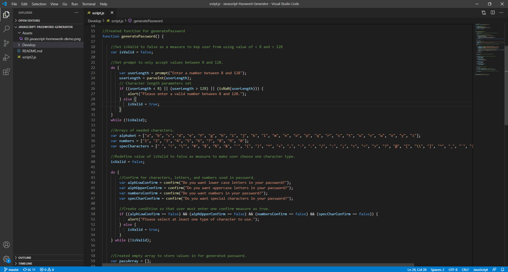
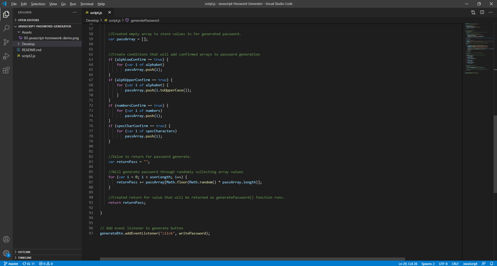

# Javascript-Password-Generator

In this assignment, I went throught the following user story:

* AS AN employee with access to sensitive data
* I WANT to randomly generate a password that meets certain criteria
* SO THAT I can create a strong password that provides greater security

THis was accompanied by these criterias:

* GIVEN I need a new, secure password

* WHEN I click the button to generate a password
* THEN I am presented with a series of prompts for password criteria
* WHEN prompted for password criteria
* THEN I select which criteria to include in the password
* WHEN prompted for the length of the password
* THEN I choose a length of at least 8 characters and no more than 128 characters
* WHEN prompted for character types to include in the password
* THEN I choose lowercase, uppercase, numeric, and/or special characters
* WHEN I answer each prompt
* THEN my input should be validated and at least one character type should be selected
* WHEN all prompts are answered
* THEN a password is generated that matches the selected criteria
* WHEN the password is generated
* THEN the password is either displayed in an alert or written to the page

## Pre-Made Browser

The assigment provided the following browser already formatted through HTML and CSS.

##Javascript

The javascript in provided was partially done. It included all selectors and a pre-made function .addEventListener that was set to the button on the html. It was linked to the writePassword function that set with the proper values in it. The only function left without a return value was generatePassword, and that is the function that was added to to make a functioning password generator.

### Code Linked to generatePassword Function

In my Javascript I included the proper comments to show the process I went through to follow the criteria.

## Link to Browser

https://auslam212.github.io/Javascript-Password-Generator/

